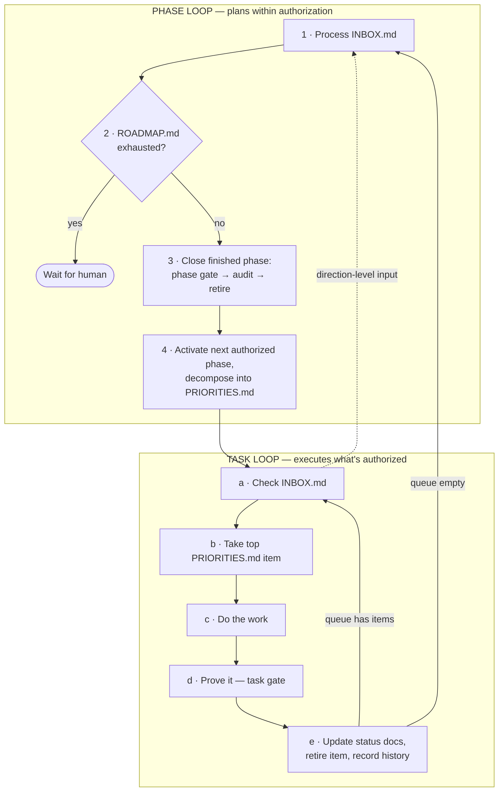

<div align="center">

# loop-engine

**Build reliable AI loops, not prompt spaghetti.**

[English](README.md) · [繁體中文](README.zh-TW.md)


</div>

loop-engine is an init scaffold — a set of Markdown templates plus a written
operating procedure — that turns "agent proposes, human types *ok*, repeat"
into "human authorizes in writing once, agent loops until the roadmap runs
out." Direction, current state, priority, and history each get exactly one
canonical file with a defined shape and update cadence. The agent reads
those files instead of asking; you steer a running loop by dropping a note
in a mailbox file instead of babysitting a chat window.

No CLI, no runtime, no lock-in to one agent tool: it's files and discipline.
Copy it into any repo — Python daemon, TypeScript CLI, Rust service — and
fill in the blanks.

- **New here?** Read [`LOOP_ENGINEERING.md`](LOOP_ENGINEERING.md) — the full
  concept, in depth. This README is the practical companion, not a
  replacement.
- **Want to see it filled in?** [`examples/linkcheck/`](examples/linkcheck/)
  is a complete worked example — every template, filled in for real.
- **Ready to adopt it?** Jump to [Quick start](#quick-start) — there's an
  interview path (an agent fills everything in) and a manual path.

---

## The problem

The default way of working with an AI coding agent: the agent proposes
something, the human says "yes" or "ok," the agent does it, repeat. Most of
those exchanges carry no information — the human is rubber-stamping because
re-explaining full context every time costs more than approving. As the
project grows it gets worse: more surface area, more decisions, more drift,
and every fresh agent session starts from zero and has to be re-briefed.

The fix is not a smarter agent. It's moving the human's judgment from
*interactive approval* to *written authorization* — spent once, on direction
and priority, in files with defined shapes — so execution never has to stop
and ask for what was already decided.

## How it works

### Four kinds of truth, one home each

| Kind of truth | Question it answers | Lives in | Changes |
| --- | --- | --- | --- |
| **Direction** | Where is this going, what must never break? | `docs/project-charter.md`, `docs/domain-model.md`, `docs/system-direction.md` | Rarely — only when a human changes the goal |
| **Current state** | What actually exists and works right now? | `docs/status.md`, `docs/build-status.md` | Every loop that changes behavior |
| **Priority** | What is the agent authorized to work on next? | `ROADMAP.md` (phase-sized), `PRIORITIES.md` (task-sized) | Every loop — items removed when done |
| **History** | What happened, when, with what evidence? | `CHANGELOG.md`, `docs/audits/`, git | Append-only |

Plus one file that is deliberately *not* truth: [`INBOX.md`](INBOX.md), the
human-input mailbox — items live there only until translated into one of the
four homes above.

Append-only doesn't mean read-every-loop: History files are written to
constantly but read on demand only, unlike the current-truth files above,
which are re-read at every loop boundary and therefore have to stay small.
See `LOOP_ENGINEERING.md`, "Reading discipline," for the full split.

### Two nested loops

The **task loop** executes one authorized task at a time. The **phase loop**
wraps it: it activates the next pre-authorized phase from `ROADMAP.md`,
decomposes it into the task queue, and closes each finished phase with
end-to-end evidence. An empty task queue is no longer a human interrupt —
it's just the signal to go back up one level.



**The authorization boundary:** the phase loop plans *within* authorization
— it may activate the next phase a human already wrote into `ROADMAP.md` and
decompose it into tasks. It may never invent a phase, reorder phases, or
promote a proposal to authorized. Those are human moves, made in writing.

### The human checkpoint: `INBOX.md`

Steer a running loop without interrupting it. Drop a note — a correction, a
new requirement, "wrong approach" — into `INBOX.md` at any time. The agent
checks it at every loop boundary and:

1. classifies each item (task-level → queue edit; direction-level → back to
   the phase loop; factual correction → fix the status docs);
2. **translates it into its canonical home and deletes it in the same
   commit** — the diff is your receipt for how your note was understood;
3. deletes only what it processed, never the whole file.

The file stays tracked in git and empty at rest: git history is the archive,
so the mailbox never accumulates token-burning backlog.

### Two verification gates

- **Task gate** — fast (lint + typecheck + tests + build), runs every task.
- **Phase gate** — expensive (integration/E2E/manual walkthrough), runs only
  when a phase closes; its evidence goes into a written audit in
  `docs/audits/`.

One gate can't do both jobs: fast-enough-per-task is too shallow to prove a
phase; thorough-enough-per-phase is too slow to run per task and would get
skipped.

## What it costs

The overhead is a fixed orientation read at the start of each agent
session: the entry point plus the current-truth files — roughly **8k
tokens** on a realistically filled-in project (measured on
`examples/linkcheck/`), plus ~5k more the first time a session opens
`LOOP_ENGINEERING.md`. That cost is capped by design: history files
(`CHANGELOG.md`, `docs/audits/`, `FRAMEWORK_FEEDBACK.md`) are excluded
from routine reads no matter how large they grow, and the current-truth
files have to stay small precisely because they're re-read every loop.

The empty-dir alternative isn't free — it moves the cost from a fixed,
capped read to an unbounded one. Every session the agent re-derives
project state from `git log` and the code, a per-session spend with high
variance; and a single instance of getting lost — redoing finished work,
re-litigating a settled decision, wandering out of scope — burns more
than a week of orientation reads.

**Skip this framework if your project fits in one or two sessions**, or
if a human reviews every turn anyway. The overhead pays for itself only
when the loop runs long and unsupervised — which is exactly the case it's
built for.

## Quick start

Step one is the same either way: **copy the repo's contents into your
project root** — except `README.md` and `README.zh-TW.md`, which describe
loop-engine, not your project. `examples/`, `CONTRIBUTING.md`, and every
`.zh-TW.md` sibling are optional to keep.

### Interview path — paste your idea, answer questions, authorize once

Open your agent inside the new repo and paste:

> Read `BOOTSTRAP.md` and follow its agent procedure. My project idea:
> *(a paragraph or a page — messy is fine, any language)*

The agent asks one batch of questions, drafts every file below, and stops
for exactly one approval: you read a five-sentence summary and say "I
authorize this" before anything loops. Full protocol, including how an
interrupted bootstrap resumes without getting lost:
[`BOOTSTRAP.md`](BOOTSTRAP.md).

Skipped the paste and just described your project in chat? Also fine: the
copied `CLAUDE.md`/`AGENTS.md` route any agent that auto-reads them (Claude
Code, Codex, Cursor, …) to `BOOTSTRAP.md` whenever the repo still carries
`TEMPLATE:` markers. The paste is just the guaranteed route on tools that
don't auto-read either file.

### Manual path — fill the files yourself

1. **Work through [`INIT_CHECKLIST.md`](INIT_CHECKLIST.md) in order** —
   charter → domain model → system direction → roadmap → status docs →
   agent entry points → priorities. Order matters; later files assume
   earlier ones are real. Keep `examples/linkcheck/` open as a filled-in
   model for every step.
2. **Delete `TEMPLATE:` markers as you fill things in**, and let the checker
   tell you what's left:
   ```bash
   ./scripts/check-templates.sh        # or scripts/check-templates.ps1
   ```
3. **Do one real loop end to end** (checklist step 11) before trusting the
   framework with unsupervised work — including dropping a note in
   `INBOX.md` mid-loop to confirm the steering channel works.

### Either way, from then on

The agent loops, `ROADMAP.md` is where you spend authorization, `INBOX.md`
is how you steer, and commit diffs are how you audit.

## File map

```
LOOP_ENGINEERING.md    concept guide — read this first
INIT_CHECKLIST.md      fill-in order for a new project
BOOTSTRAP.md           the same checklist run as an agent-led interview — paste your idea, answer one batch of questions, authorize once
CLAUDE.md / AGENTS.md  agent entry points (keep in sync; different tools read different files)
ROADMAP.md             pre-authorized phase queue — the phase loop plans from this
PRIORITIES.md          ordered, rule-governed task queue — the task loop executes from this
INBOX.md               human checkpoint mailbox — empty at rest, ships ready to use
CHANGELOG.md           history
FRAMEWORK_FEEDBACK.md  append-only flight recorder for defects in the framework itself — harvested upstream to loop-engine
CONTRIBUTING.md        how to propose changes to this scaffold itself
LICENSE                MIT

docs/
  README.md            index of the docs below
  project-charter.md   mission, core areas, guardrails, documentation contract
  domain-model.md      shared vocabulary — names for the things this project has
  system-direction.md  target architecture and refactor priorities
  status.md            current behavior in detail + both verification gates
  build-status.md      coarse Built/Partial/Planned/Blocked map + dated evidence log
  release.md           versioning scheme and release checklist
  audits/              phase-completion evidence; TEMPLATE.md stays blank forever

scripts/
  check-templates.sh|.ps1  finds leftover TEMPLATE: markers; exit 1 if any remain

examples/
  linkcheck/           a complete, fully-filled-in instance of every template above
```

| File | Purpose | Who writes it | Cadence |
| --- | --- | --- | --- |
| `docs/project-charter.md` | Mission, guardrails | Human (agent drafts) | Rarely |
| `docs/domain-model.md` | One canonical name per concept | Human + agent, early | Grows with new concepts |
| `docs/system-direction.md` | Target architecture vs. current fit | Human + agent | Occasionally |
| `ROADMAP.md` | Pre-authorized phase queue | **Human authorizes**; agent activates & retires | Per phase |
| `PRIORITIES.md` | Ordered task queue | Agent decomposes; human can insert | Every loop |
| `INBOX.md` | Human → running loop channel | Human writes; agent translates & clears | Any time; empty at rest |
| `docs/status.md` | Exact current behavior + gates | Agent | Every loop |
| `docs/build-status.md` | Coarse status + dated proof log | Agent | At milestones |
| `docs/audits/*` | Evidence a phase is actually done | Agent, at phase close | Once per phase, append-only |
| `CHANGELOG.md` | Release-visible history | Agent; human at release | Every loop / release |
| `FRAMEWORK_FEEDBACK.md` | Defects found in the framework itself | Agent appends; human harvests upstream | On friction; append-only |

## Design principles

- **Evidence over assertion.** "It should work" is never sufficient. A
  passing gate, a specific manual result, or a dated audit entry is what
  "done" means here.
- **One canonical home per fact.** A fact that lives in two docs will
  eventually disagree with itself in one of them.
- **Order is a decision, not a suggestion.** Both queues are strictly
  ordered so "what's next" never needs to be asked.
- **Plans within authorization, never creates it.** The agent's planning
  power is bounded by what a human already wrote into `ROADMAP.md`.
- **Steering is a file, not a conversation.** `INBOX.md` decouples the
  human's availability from the loop's progress — and the
  translate-then-clear-in-one-commit rule makes every instruction auditable.
- **Stack-agnostic by design.** Every template describes a *shape*, not
  framework-specific content.

## FAQ

**Do I need every one of these files for a small project?**
Keep the shape even when a section is short. The four you must not skip:
`docs/project-charter.md`, `docs/domain-model.md`, `ROADMAP.md`, and
`PRIORITIES.md` — those are what make autonomous looping possible at all.

**What happens when `PRIORITIES.md` runs empty?**
The agent returns to the phase loop: close the finished phase (phase gate +
audit), activate the next authorized one, refill the queue. It only stops
and waits for you when `ROADMAP.md` itself is exhausted — that's the real
"wait for human" condition, and it's a success state, not a failure.

**How do I redirect the agent mid-run?**
Write to `INBOX.md`. Task-level notes get folded into the queue without
breaking stride; direction-level notes bounce the agent back to the phase
loop to re-plan. Either way the commit that clears your note contains the
edits it turned into, so you can verify it was understood.

**What stops the agent from authorizing its own work?**
The write rules on `ROADMAP.md`: the agent may activate the next phase and
retire completed ones, but adding, reordering, or promoting phases is
human-only. It can *propose* (under "Proposed — Not Yet Authorized"); it
cannot approve.

**Does this work with any AI coding agent, not just Claude Code?**
Yes — `CLAUDE.md` and `AGENTS.md` are kept in sync on purpose because
different tools read different filenames. The mechanism (docs as an
authorization contract) isn't tool-specific.

**How do I know the docs haven't gone stale?**
`docs/status.md` says it explicitly: if the doc and the code disagree, the
code wins — fix the doc as part of whatever change you're making. Drift is a
bug, not a nice-to-have.

**Isn't this just a project-management tool in disguise?**
A backlog tracks *what* to do. This is about *why an agent can act without
asking first* — the charter and domain model pre-authorize its judgment
calls, not just its task list.

**Why do only some files have a Traditional Chinese version?**
Only five purely-reference docs — `LOOP_ENGINEERING.md`,
`INIT_CHECKLIST.md`, `BOOTSTRAP.md`, `CONTRIBUTING.md`,
`examples/README.md` — have
`.zh-TW.md` siblings, because they never get filled in with project-specific
content, so they can safely stay bilingual forever. `CLAUDE.md`/`AGENTS.md`/
`PRIORITIES.md`/`ROADMAP.md`/`INBOX.md`/`docs/*.md` deliberately do **not**
— their filenames are functionally load-bearing (Claude Code looks for the
exact name `CLAUDE.md`, the loop procedure reads `PRIORITIES.md` by exact
path) and they get filled with real, live-mutating content once a project
starts. Maintaining two live language copies of a mutable source of truth
would produce two canonical homes fighting each other — a direct violation
of "one canonical home per fact." What language your team writes the real
content in is entirely your call; the scaffold doesn't prescribe it.

## Non-goals

- **Not a project generator or CLI.** There's no `loop-engine init`. Copy
  the files, then fill them in — by hand (`INIT_CHECKLIST.md`) or via the
  agent-led interview (`BOOTSTRAP.md`); either way it's files and
  discipline, not tooling.
- **Not a substitute for tests, CI, or code review.** The gates are how an
  agent proves work is done; they don't replace your quality bar.
- **Not a way to remove the human.** It relocates human judgment to where
  it's actually needed: direction, authorization, and danger calls.

## Contributing

Improvements to the scaffold itself are welcome — see
[`CONTRIBUTING.md`](CONTRIBUTING.md). The bar: a change must keep the four
kinds of truth separable, keep `examples/linkcheck/` in sync, and keep every
bilingual file pair in agreement.

## License

[MIT](LICENSE)
