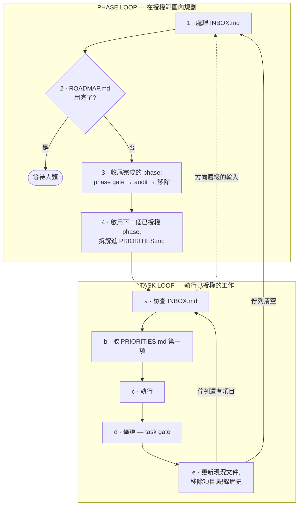

<div align="center">

# loop-engine

**打造可靠的 AI 迴圈，不是一團 prompt 義大利麵。**

[English](README.md) · [繁體中文](README.zh-TW.md)


</div>

loop-engine 是一套初始化腳手架——一組 Markdown 模板加上一份成文的作業程序——
把「agent 提案、人類打 *ok*、無限重複」變成「人類一次性書面授權,agent 自己
一圈一圈跑到 roadmap 用完為止」。方向、現況、優先序、歷史,四種真相各自有唯一
的正典檔案、固定的格式與更新節奏。Agent 讀檔案而不是問你;你想中途調整方向,
往信箱檔丟一句話就好,不用守著聊天視窗。

沒有 CLI、沒有 runtime、不綁定任何一家 agent 工具:它就是檔案加紀律。複製進
任何 repo——Python daemon、TypeScript CLI、Rust service——把空格填上即可。

- **第一次來?** 先讀 [`LOOP_ENGINEERING.zh-TW.md`](LOOP_ENGINEERING.zh-TW.md)
  ——完整的概念說明。這份 README 是實作指南,不是它的替代品。
- **想看填好的樣子?** [`examples/linkcheck/`](examples/linkcheck/) 是一份
  完整的實例——每個模板都真實填寫完畢。
- **準備採用?** 直接跳到 [快速開始](#快速開始)——有訪談路線(agent 幫你
  填完一切)和手動路線兩條路。

---

## 要解決的問題

跟 AI coding agent 合作的預設模式:agent 提案,人類說「好」或「ok」,agent
執行,重複。這些往返絕大多數不帶任何資訊——人類蓋章只是因為每次重新解釋完整
脈絡,比直接批准更貴。專案越大越糟:表面積更大、決策更多、偏移更容易,而且
每個新開的 agent session 都從零開始,得重新簡報一次。

解法不是更聰明的 agent,而是把人類的判斷從「互動式批准」搬到「書面授權」——
在格式固定的檔案裡,對方向和優先序一次花掉——讓執行過程再也不必為了早就決定
過的事停下來問。

## 運作方式

### 四種真相,各有唯一的家

| 真相種類 | 回答的問題 | 住在哪 | 更新頻率 |
| --- | --- | --- | --- |
| **方向** | 要去哪裡?什麼絕對不能壞? | `docs/project-charter.md`、`docs/domain-model.md`、`docs/system-direction.md` | 極少——只在人類改變目標時 |
| **現況** | 現在到底有什麼、什麼能動? | `docs/status.md`、`docs/build-status.md` | 每個改變行為的迭代 |
| **優先序** | agent 下一步被授權做什麼? | `ROADMAP.md`(phase 級)、`PRIORITIES.md`(task 級) | 每個迭代——完成即移除 |
| **歷史** | 發生過什麼、何時、證據是什麼? | `CHANGELOG.md`、`docs/audits/`、git | 只增不改 |

另外有一個刻意**不是**真相的檔案:[`INBOX.md`](INBOX.md),人類輸入的信箱——
項目只暫存到被翻譯進上面四個家為止。

「只增不改」不等於「每輪都要讀」:歷史檔案持續被寫入,但只按需讀取,跟上面那
些每個迴圈邊界都會被重讀、因此必須保持精簡的當前真相檔案不一樣。完整說明見
`LOOP_ENGINEERING.zh-TW.md` 的「讀取紀律」。

### 兩層嵌套迴圈

**Task loop(小迴圈)** 一次執行一個已授權的任務。**Phase loop(大迴圈)** 包在
外面:從 `ROADMAP.md` 啟用下一個預先授權的 phase、拆解成任務佇列,並在每個
phase 結束時用端到端證據收尾。任務佇列清空不再是「叫人類來」——它只是回到上
一層的訊號。



**授權邊界:** phase loop 在授權範圍**內**規劃——它可以啟用人類已寫進
`ROADMAP.md` 的下一個 phase 並拆解成任務;它永遠不能自己發明 phase、重排
phase、或把提案升格為已授權。那些是人類的動作,以書面完成。

### 人類中繼點:`INBOX.md`

不打斷迴圈也能轉向。任何時候把一句話——修正、新需求、「方向錯了」——丟進
`INBOX.md`。Agent 在每個迴圈邊界檢查它,然後:

1. 逐項分類(task 級 → 改佇列;方向級 → 彈回 phase loop;事實修正 → 改現況
   文件);
2. **翻譯進正典檔案,並在同一個 commit 裡刪除該項**——diff 就是「你的話被
   理解成什麼」的回執;
3. 只刪處理過的項目,永遠不整檔清空。

這個檔案保持被 git 追蹤、平時是空的:git 歷史就是完整檔案庫,信箱本身永遠
不會堆積吃 token 的舊訊息。

### 兩層驗證關卡

- **Task gate**——快(lint + typecheck + test + build),每個任務都跑。
- **Phase gate**——貴(整合測試/E2E/人工走查),只在 phase 收尾時跑;證據
  寫進 `docs/audits/` 的書面 audit。

一個關卡做不了兩件事:快到每個任務都能跑的,淺到證明不了整個 phase;深到能
證明 phase 的,慢到沒人願意每個任務都跑——會被跳過,而被跳過的關卡保護不了
任何東西。

## 這要花多少 token

框架的開銷是每個 agent session 開頭一次固定的定向閱讀:入口檔加上「當前
真相」檔案——在一個實際填好的專案上約 **8k token**(以
`examples/linkcheck/` 實測),session 第一次打開 `LOOP_ENGINEERING.md`
再多約 5k。這個成本被設計成有上限:歷史檔案(`CHANGELOG.md`、
`docs/audits/`、`FRAMEWORK_FEEDBACK.md`)不管長到多大都排除在例行閱讀之
外,而當前真相檔案正因為每圈都要重讀,必須保持精簡。

空目錄的替代方案並不是免費的——它只是把成本從一次固定、有上限的閱讀,搬
成一筆沒有上限的支出。每個 session,agent 都得從 `git log` 和程式碼重新
推導專案狀態,每次花費高低不定;而只要迷路一次——重做已完成的工作、重新
爭論已定案的決策、越出授權範圍——燒掉的 token 就超過一整週的定向閱讀。

**如果你的專案一兩個 session 就能做完,跳過這個框架**;如果每一輪都有人
盯著審,也一樣。這筆開銷只有在迴圈長時間無人監督地跑的時候才回本——而那
正是它被造出來要服務的場景。

## 快速開始

無論走哪條路,第一步都一樣:**把整個 repo 的內容複製進你的專案根目錄**——
除了 `README.md` 和 `README.zh-TW.md`(它們描述的是 loop-engine,不是你的
專案)。`examples/`、`CONTRIBUTING.md`,以及這幾個檔案的 `.zh-TW.md` 版本
都可留可刪。

### 訪談路線——貼上想法、回答問題、授權一次

在新 repo 裡開啟你的 agent,貼上:

> 讀 `BOOTSTRAP.md` 並照它的 agent 程序執行。我的專案想法:
> *(一段話或一整頁——寫得亂沒關係,任何語言都可以)*

Agent 會一批問完問題、起草下面的每一份檔案,然後只為一件事停下來:你讀完一
份五句話的摘要,說「我授權這份內容」,任何迴圈才會開始。完整協議(包括
bootstrap 被中斷後怎麼不迷路地接續)見
[`BOOTSTRAP.zh-TW.md`](BOOTSTRAP.zh-TW.md)。

沒貼提示、只是直接在聊天裡描述了你的專案?也可以:複製進來的
`CLAUDE.md`/`AGENTS.md` 會在 repo 還帶著 `TEMPLATE:` 標記時,把任何會自動讀
這兩個檔案的 agent(Claude Code、Codex、Cursor……)導向 `BOOTSTRAP.md`。
貼提示只是在「不會自動讀這兩個檔案的工具」上也保證有效的那條路。

### 手動路線——自己填檔案

1. **照順序走完 [`INIT_CHECKLIST.zh-TW.md`](INIT_CHECKLIST.zh-TW.md)**——
   charter → domain model → system direction → roadmap → 現況文件 →
   agent 入口 → priorities。順序有意義:後面的檔案假設前面的已經是真的。過
   程中把 `examples/linkcheck/` 開在旁邊當每一步的填寫範本(這個範例只有英
   文版)。
2. **邊填邊刪 `TEMPLATE:` 標記**,用檢查腳本找漏網之魚:
   ```bash
   ./scripts/check-templates.sh        # Windows 用 scripts/check-templates.ps1
   ```
3. **完整跑一次真實迴圈**(checklist 第 11 步)再把無人監督的工作交給它——
   包括中途往 `INBOX.md` 丟一句話,確認轉向通道真的有效。

### 無論哪條路,之後都是

Agent 自己迴圈,`ROADMAP.md` 是你花授權的地方,`INBOX.md` 是你轉向的地方,
commit diff 是你稽核的地方。

## 檔案地圖

```
LOOP_ENGINEERING.md    概念指南——先讀這個
INIT_CHECKLIST.md      新專案的填寫順序
BOOTSTRAP.md           同一份清單的訪談版——貼上想法、一批回答、授權一次
CLAUDE.md / AGENTS.md  agent 入口(保持同步;不同工具讀不同檔名)
ROADMAP.md             預先授權的 phase 佇列——phase loop 據此規劃
PRIORITIES.md          有序、有規則的任務佇列——task loop 據此執行
INBOX.md               人類中繼點信箱——平時是空的,開箱即用
CHANGELOG.md           歷史
FRAMEWORK_FEEDBACK.md  框架本身缺陷的飛行記錄器——只增不改,回收到上游 loop-engine
CONTRIBUTING.md        如何對腳手架本身提出修改
LICENSE                MIT

docs/
  README.md            下列文件的索引
  project-charter.md   使命、核心領域、護欄、文件契約
  domain-model.md      共享詞彙——這個專案裡的東西叫什麼名字
  system-direction.md  目標架構與重構優先序
  status.md            當前行為的細節 + 兩層驗證關卡
  build-status.md      粗粒度 Built/Partial/Planned/Blocked 表 + 有日期的證據日誌
  release.md           版本規則與發佈清單
  audits/              phase 完成證據;TEMPLATE.md 永遠保持空白模板

scripts/
  check-templates.sh|.ps1  找出殘留的 TEMPLATE: 標記;有殘留就 exit 1

examples/
  linkcheck/           上述所有模板的完整填寫實例
```

| 檔案 | 用途 | 誰來寫 | 節奏 |
| --- | --- | --- | --- |
| `docs/project-charter.md` | 使命、護欄 | 人類(agent 起草) | 極少 |
| `docs/domain-model.md` | 每個概念一個正典名字 | 人類 + agent,越早越好 | 隨新概念成長 |
| `docs/system-direction.md` | 目標架構 vs. 現況落差 | 人類 + agent | 偶爾 |
| `ROADMAP.md` | 預先授權的 phase 佇列 | **人類授權**;agent 啟用與移除 | 每個 phase |
| `PRIORITIES.md` | 有序任務佇列 | agent 拆解;人類可插入 | 每個迭代 |
| `INBOX.md` | 人類 → 運行中迴圈的通道 | 人類寫;agent 翻譯後清空 | 隨時;平時是空的 |
| `docs/status.md` | 精確的當前行為 + 關卡 | agent | 每個迭代 |
| `docs/build-status.md` | 粗粒度狀態 + 有日期的證據 | agent | 每個里程碑 |
| `docs/audits/*` | phase 真的完成的證據 | agent,phase 收尾時 | 每 phase 一次,只增不改 |
| `CHANGELOG.md` | 對外可見的歷史 | agent;發佈時人類 | 每迭代/每發佈 |
| `FRAMEWORK_FEEDBACK.md` | 框架本身的缺陷紀錄 | agent 追加;人類回收到上游 | 遇到摩擦時;只增不改 |

## 設計原則

- **證據高於宣稱。**「應該可以動」永遠不夠。通過的關卡、具體的人工驗證結果、
  有日期的 audit 條目,才是這裡「完成」的定義。
- **每個事實只有一個正典的家。** 能同時住在兩份文件裡的事實,遲早會在其中一份
  裡跟自己吵架。
- **順序是決策,不是建議。** 兩個佇列都嚴格排序,所以「下一個做什麼」永遠不需
  要開口問。
- **在授權內規劃,永不自我授權。** agent 的規劃權力被人類已寫進 `ROADMAP.md`
  的內容框住。
- **轉向是一個檔案,不是一場對話。**`INBOX.md` 把人類的在場與迴圈的進度解耦
  ——而「翻譯後同 commit 清空」規則讓每一條指令都可稽核。
- **與技術棧無關。** 每個模板描述的是*形狀*,不是特定框架的內容。

## 常見問題

**小專案也需要全部這些檔案嗎?**
段落可以短,形狀要留著。絕對不能跳過的四個:`docs/project-charter.md`、
`docs/domain-model.md`、`ROADMAP.md`、`PRIORITIES.md`——自主迴圈能不能成立
就靠它們。

**`PRIORITIES.md` 清空了會怎樣?**
Agent 回到 phase loop:收尾完成的 phase(phase gate + audit)、啟用下一個已
授權的 phase、重新填佇列。只有 `ROADMAP.md` 本身用完時它才停下來等你——那才
是真正的「等待人類」,而且是成功狀態,不是故障。

**怎麼在 agent 跑到一半時改方向?**
寫進 `INBOX.md`。Task 級的意見會被折進佇列、不打斷節奏;方向級的意見會把
agent 彈回 phase loop 重新規劃。無論哪種,清掉你那句話的 commit 裡就包含它
被翻譯成的修改——你可以驗證它有沒有被理解對。

**什麼擋住 agent 給自己授權?**
`ROADMAP.md` 的寫入規則:agent 可以啟用下一個 phase、移除完成的 phase,但
新增、重排、升格 phase 都只有人類能做。它可以*提案*(放進「Proposed — Not
Yet Authorized」),不能批准。

**只能配 Claude Code 用嗎?**
不是——`CLAUDE.md` 和 `AGENTS.md` 刻意保持同步,就是因為不同工具讀不同檔名。
機制本身(文件即授權契約)跟工具無關。

**怎麼知道文件沒有過期?**
`docs/status.md` 明寫:文件和程式碼不一致時,以程式碼為準——修文件是你手上
那個修改的一部分。漂移是 bug,不是「有空再補」。

**這不就是換皮的專案管理工具?**
Backlog 工具追蹤*要做什麼*。這裡解決的是*為什麼 agent 可以不先問就動手*——
charter 和 domain model 預先授權的是它的判斷,不只是它的任務清單。

**為什麼只有部分檔案有繁體中文版?**
只有五份純參考文件——`LOOP_ENGINEERING.md`、`INIT_CHECKLIST.md`、
`BOOTSTRAP.md`、`CONTRIBUTING.md`、`examples/README.md`——有 `.zh-TW.md`
版本,因為它們永遠不會被填入專案專屬內容,可以安全地永久保持雙語。`CLAUDE.md`/`AGENTS.md`/
`PRIORITIES.md`/`ROADMAP.md`/`INBOX.md`/`docs/*.md` 這些**沒有**繁中版
——它們的檔名本身是功能性的(Claude Code 認 `CLAUDE.md`、loop 程序寫死要讀
`PRIORITIES.md` 這些確切檔名),而且一旦專案開始運作就會被填入真實、會變動的
內容。同時維護兩份語言的活文件,只會製造出兩個互相打架的正典來源——直接違反
「每個事實只有一個正典的家」這條設計原則。你的團隊要用什麼語言寫這些活文件的
實際內容,完全由你們自己決定;框架本身不規定。

## 非目標

- **不是產生器也不是 CLI。** 沒有 `loop-engine init`。複製檔案,然後填進去
  ——自己填(`INIT_CHECKLIST.md`)或讓 agent 訪談你之後幫你填
  (`BOOTSTRAP.md`);無論哪種,都是檔案加紀律,不是工具鏈。
- **不取代測試、CI 或 code review。** 關卡是 agent 舉證的方式,不是你品質
  標準的替代品。
- **不是把人類移出迴圈。** 是把人類的判斷搬到真正需要它的地方:方向、授權、
  危險判斷。

## 貢獻

歡迎改進腳手架本身——見 [`CONTRIBUTING.zh-TW.md`](CONTRIBUTING.zh-TW.md)
(或英文版 [`CONTRIBUTING.md`](CONTRIBUTING.md))。門檻:修改必須維持四種真
相可分離、讓 `examples/linkcheck/` 保持同步、讓每一組雙語文件內容一致。

## 授權條款

[MIT](LICENSE)
